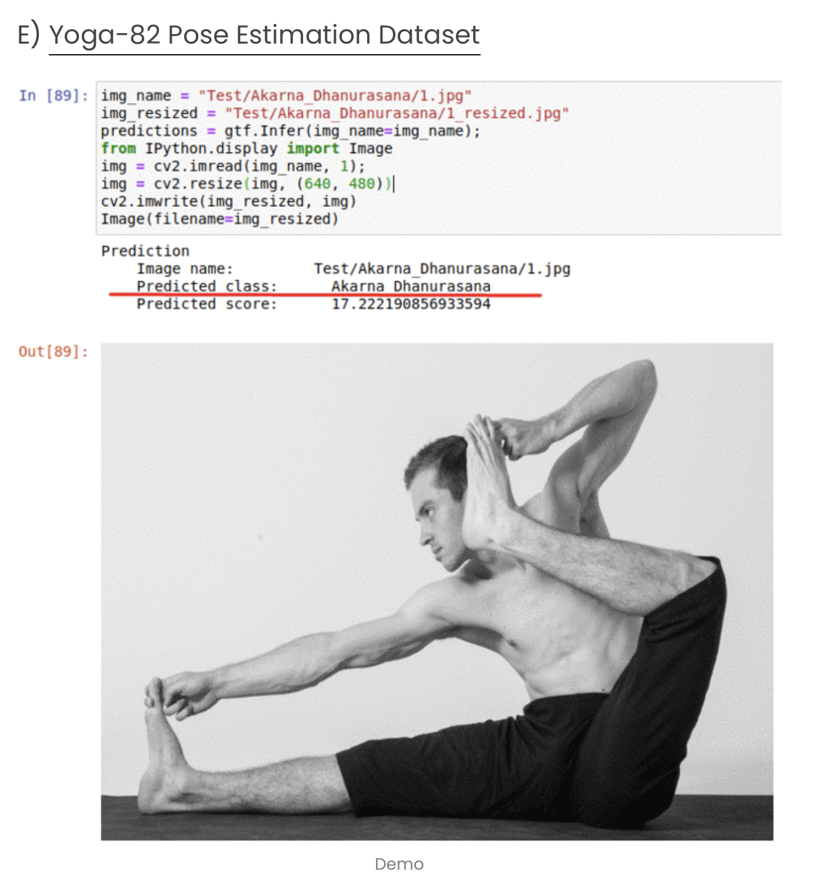
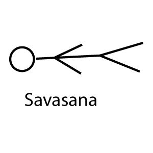

# Yoga Pose CNN Classifier
[Presentaion](https://docs.google.com/presentation/d/1-_eTGVwHYeeBWJnwNNcv4qsyX2wH1dNfAgzpKdH4cvg/edit#slide=id.p)
## Replicate this using Keras & TensorFlow 2:


[Credit](https://towardsai.net/p/computer-vision/70-image-classification-datasets-from-different-industry-domains-part-2-cd1af6e48eda)
[Project Homepage](https://sites.google.com/view/yoga-82/home)
Topic: Image identification of Yoga Poses using Yoga82 project data
High level description of project: Perform supervised ML analysis of images with yoga poses to train model for pose name detection
Data Source(s): https://sites.google.com/view/yoga-82/home
https://drive.google.com/file/d/12hySxD-piXCuCH65doUMNXNLMo-Jwt_3/view
Description of Data:
20K+ images with 82 different yoga pose classes
Human pose estimation is a well-known problem in computer vision to locate joint positions. Existing datasets for learning of poses are observed to be not challenging enough in terms of pose diversity, object occlusion and view points. This makes the pose annotation process relatively simple and restricts the application of the models that have been trained on them. To handle more variety in human poses, we propose the concept of fine-grained hierarchical pose classification, in which we formulate the pose estimation as a classification task, and propose a dataset, Yoga-82, for large-scale yoga pose recognition with 82 classes. Yoga-82 consists of complex poses where fine annotations may not be possible. To resolve this, we provide hierarchical labels for yoga poses based on the body configuration of the pose. The dataset contains a three-level hierarchy including body positions, variations in body positions, and the actual pose names. We present the classification accuracy of the state-of-the-art convolutional neural network architectures on Yoga-82. We also present several hierarchical variants of DenseNet in order to utilize the hierarchical labels.
(Optional) Potential Future Employer: Employers utilizing NN in their data science workflow

## SRC data
[EDA_Yoga.py](src/EDA_Yoga.py) - Parse *.txt files in [data/yoga_dataset_links](data/yoga_dataset_links) to download files locally with
* `response = requests.get(img_url, timeout=(5,5))  # timeout for connect and read`
* Example line from file Extended_Revolved_Triangle_Pose_or_Utthita_Trikonasana_.txt:
`Extended_Revolved_Triangle_Pose_or_Utthita_Trikonasana_/1_660.jpg	http://mindfullywritten.com/wp ...`

[download_image_files.py](src/download_image_files.py) - Reshuffle downloaded files into KERAS [image_dataset_from_directory function](https://keras.io/api/preprocessing/image/), namely directory of shape
```
main_directory/
...class_a/
......a_image_1.jpg
......a_image_2.jpg
...class_b/
......b_image_1.jpg
......b_image_2.jpg
```
## notebooks
[KERAS_test.ipynb](notebooks/KERAS_test.ipynb) TensorFlow 2
* model creation using KERAS API (90, 180, 360) images
* model training
* performance monitoring, figure savings
* confusion matrix evaluation

## CREDIT:
Please cite the following paper if you use the dataset.
@inproceedings{verma2020yoga,
 title={Yoga-82: A New Dataset for Fine-grained Classification of Human Poses},
 author={Verma, Manisha and Kumawat, Sudhakar and Nakashima, Yuta and Raman, Shanmuganathan},
 booktitle={IEEE/CVF Conference on Computer Vision and Pattern Recognition Workshops (CVPRW)},
 pages={4472-4479},
 year={2020}
}
https://towardsai.net/p/computer-vision/70-image-classification-datasets-from-different-industry-domains-part-2-cd1af6e48eda

## Data Structure:
Data consists of text files combining URL references to specific images online with detailed information regarding identification of a specific image.
References are split into training and test sets.
